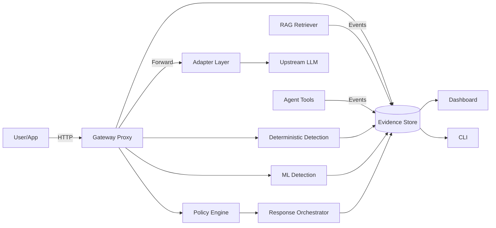

# System Map

## Core Components

### 1. Gateway Proxy (FastAPI)
- OpenAI-compatible HTTP endpoints
- Streaming support (SSE)
- Session metadata headers (X-Session-ID, X-Trace-ID)
- Health check endpoints
- Metrics endpoint (Prometheus format)

### 2. Adapter Layer
- Provider abstraction interface
- Implementations: OpenAI, Anthropic, Azure, Ollama
- Retry logic with exponential backoff
- Cost tracking hooks

### 3. Policy Engine (OPA)
- Rego policy packs
- Runtime toggle (observe/enforce)
- Policy versioning
- Dry-run mode

### 4. Detection Engine
- Deterministic detector suite (DLP, injection patterns)
- ML models:
  - Anomaly detector (IsolationForest)
  - Supervised classifier (injection/benign)

### 5. Taint Engine
- Taint label creation
- Propagation rules
- Lineage graph storage
- Taint sink monitoring

### 6. Response Orchestrator
- Playbook executor
- Action enforcement (block/sanitize/quarantine/throttle)
- Kill switch control
- Mode switching (observe/enforce)

### 7. Evidence Store
- SQLite default (Postgres optional)
- Normalized event schema
- Incident aggregation
- JSONL export

### 8. Dashboard + CLI
- Streamlit dashboard (sessions, alerts, lineage, explanations)
- CLI for event tailing and artifact export

## Data Flow



## Port Assignments

| Service | Port | Description |
|---------|------|-------------|
| Gateway | 8080 | Main API endpoint |
| OPA | 8181 | Policy engine |
| Dashboard | 8501 | Streamlit UI |
| Metrics | 9090 | Prometheus |
| Evidence DB | - | SQLite file |

## Environment Variables

```bash
# Required
AIRS_MODE=observe|enforce
AIRS_PROVIDER=openai|anthropic|azure|ollama

# Provider-specific
OPENAI_API_KEY=sk-...
ANTHROPIC_API_KEY=sk-ant-...
AZURE_OPENAI_ENDPOINT=https://...
AZURE_OPENAI_KEY=...
OLLAMA_HOST=http://localhost:11434

# Optional
AIRS_MODEL=gpt-4|claude-3|llama3.2:1b
AIRS_LOG_LEVEL=DEBUG|INFO|WARNING|ERROR
AIRS_DB_PATH=/data/evidence.db
```

## API Endpoints (Phase 1)

### Proxy Mode (OpenAI-compatible)
```
POST /v1/chat/completions      # Chat completion (streaming supported)
POST /v1/completions           # Legacy completion
GET  /v1/models                # List available models
```

### Control Plane
```
GET  /health                   # Health check
GET  /metrics                  # Prometheus metrics
GET  /status                   # System status
POST /mode                     # Switch observe/enforce
POST /kill                     # Emergency kill switch
```

### Evidence (Phase 2+)
```
GET  /events                   # List security events
GET  /events/{id}              # Get event details
GET  /sessions                 # List sessions
GET  /sessions/{id}/lineage    # Get taint lineage
```
